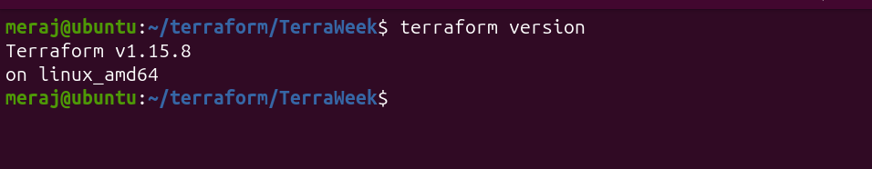
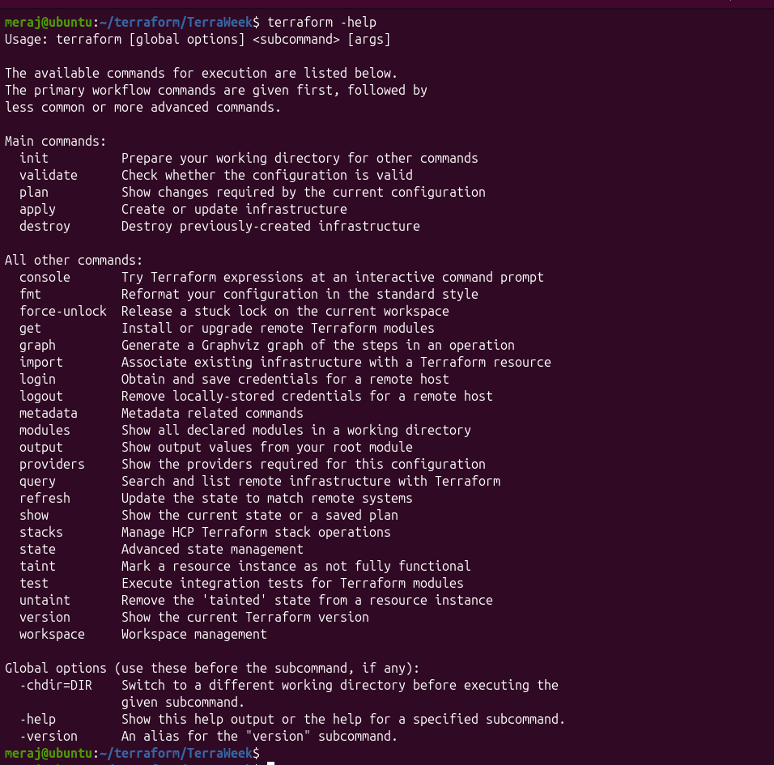
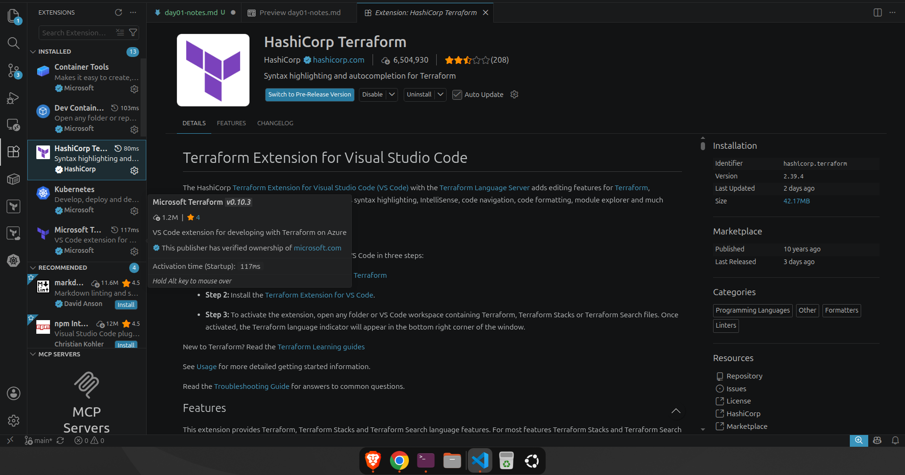
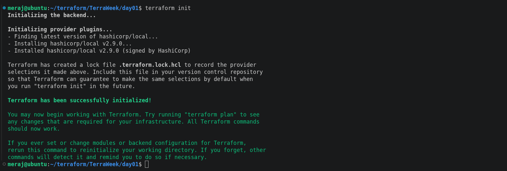
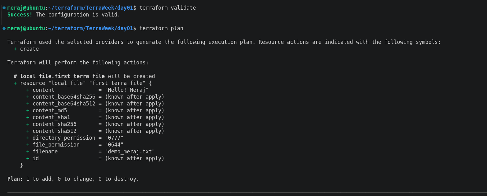
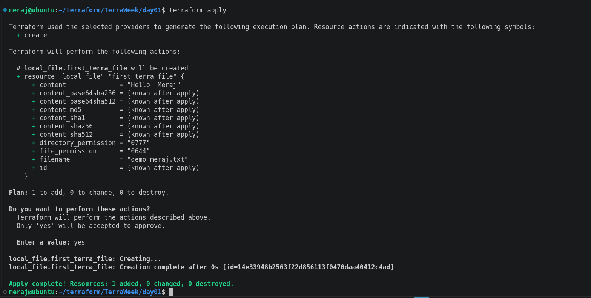
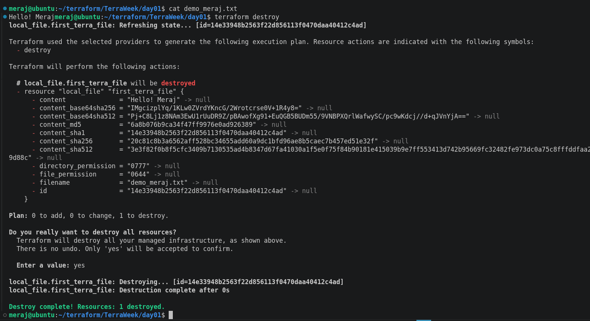

# 🌱 TerraWeek Day 1 — Introduction to IaC & Terraform Basics

---

## Task 1: Understanding IaC & Terraform

### What is Infrastructure as Code, and what problems does it solve?

Infrastructure as Code (IaC) means defining our servers, networks, and
other infrastructure in text files instead of clicking through a cloud
console. That code is version-controlled, reviewed, and applied the same
way application code is.

Problems it solves compared to clicking around a console:

- **No repeatability** — console clicks aren't recorded anywhere, so
  rebuilding an environment means re-clicking everything and hoping you remember every setting.
- **No audit trail** — "who changed this security group and why?" is
  unanswerable in a console; in Git it's a diff and a commit message.
- **Configuration drift** — manual changes pile up until no one knows
  what the "real" state of the environment is.
- **No review process** — you can't PR-review a click. IaC lets
  infrastructure changes go through the same code review as application
  changes.
- **Slow, error-prone scaling** — spinning up 50 identical servers by
  hand invites mistakes; a loop in code doesn't.

### What is Terraform, and why is it so popular?

Terraform is an open-source IaC tool from HashiCorp that helps us to 
**declare** the infrastructure want (in HCL) and it figures out how
to create, update, or destroy resources to match that declaration.

It's popular because it's:

- **Declarative** — we describe the *end state*, not the steps to get
  there; Terraform computes the diff and the execution plan for us.
- **Provider-agnostic** — the same workflow (`init`/`plan`/`apply`)
  works across AWS, Azure, GCP, Kubernetes, Datadog, GitHub, and
  hundreds of other providers, so teams don't need a different tool per
  cloud.
- **Backed by a huge ecosystem** — the Terraform Registry has
  thousands of providers and reusable modules, so you rarely start from
  zero.
- **Stateful** — it keeps a state file that maps your code to real-world
  resources, which is what makes accurate diffs and safe updates
  possible.

### Terraform vs alternatives

| Tool | One-line comparison |
|---|---|
| **OpenTofu** | A community-governed, MIT-licensed fork of Terraform (created after HashiCorp's 2023 license change) — near drop-in compatible with Terraform HCL and workflow. |
| **Pulumi** | Same IaC idea, but it's written in real programming languages (Python, TypeScript, Go) instead of HCL, trading a bespoke DSL for general-purpose language power. |
| **AWS CloudFormation** | AWS-native and free, but locked to AWS only — Terraform trades that tight integration for multi-cloud portability. |
| **Ansible** | Primarily a *configuration management* tool (installing packages, managing files on existing servers) that's procedural by default, whereas Terraform is a *provisioning* tool that's declarative — they're often used together (Terraform builds the box, Ansible configures it). |

---

## Task 2: Installing Terraform

Install Terraform ≥ 1.15 following the official guide for your OS:
👉 https://developer.hashicorp.com/terraform/install

**Linux (Debian/Ubuntu, HashiCorp apt repo):**
```bash
wget -O- https://apt.releases.hashicorp.com/gpg | sudo gpg --dearmor -o /usr/share/keyrings/hashicorp-archive-keyring.gpg
echo "deb [signed-by=/usr/share/keyrings/hashicorp-archive-keyring.gpg] https://apt.releases.hashicorp.com $(lsb_release -cs) main" | sudo tee /etc/apt/sources.list.d/hashicorp.list
sudo apt update && sudo apt install terraform
```

**Verify the install:**
```bash
terraform version
```
> 

```bash
terraform -help
```

> 

installed the **HashiCorp Terraform** extension in VS Code

> 

---

## Task 3: Six Crucial Terraform Terms

1. **Provider** — a plugin that lets Terraform talk to a specific
   platform's API.
   *Example: the `aws` provider lets Terraform create S3 buckets and EC2 instances.*

2. **Resource** — a single piece of infrastructure that Terraform
   creates and manages.
   *Example: `resource "aws_instance" "web" { ... }` is one EC2 instance.*

3. **State** — Terraform's record of what it has already created, stored
   in `terraform.tfstate`, used to compute diffs on the next run.
   *Example: after `apply`, the state file remembers the exact ID of the S3 bucket it made.*

4. **Plan** — a dry-run preview showing exactly what will be added,
   changed, or destroyed before anything actually happens.
   *Example: `terraform plan` might show `+ create` for a new bucket and `~ update` for a resized disk.*

5. **HCL (HashiCorp Configuration Language)** — the declarative syntax
   used to write `.tf` files.
   *Example: `variable "region" { default = "us-east-1" }` is a line of HCL.*

6. **Module** — a reusable, self-contained bundle of `.tf` files that
   can be called with different inputs.
   *Example: a `vpc` module you call once for `dev` and again for `prod` with different CIDR blocks.*

---

## Task 4: First Terraform Config (no cloud account needed)

Run the core workflow and capture the output of each step for your post:

```bash
cd day01
terraform init      # downloads the local & random providers
terraform fmt        # auto-formats the code
terraform validate   # checks for syntax errors
terraform plan        # previews: 1 random_pet + 1 local_file to add
terraform apply       # type "yes" — creates greeting.txt
cat greeting.txt       # see the file Terraform generated
terraform destroy     # type "yes" — cleans everything up
```
> 

> 

> 

> 

### 🔁 The Core Terraform Workflow

```
  Write  ──▶  Init  ──▶  Plan  ──▶  Apply  ──▶  Destroy
  (.tf)     (init)     (preview)   (create)    (clean up)
```

- **Write** — author `.tf` files describing desired state.
- **Init** — download the providers/modules referenced in the config.
- **Plan** — compute and display the diff between current and desired state.
- **Apply** — execute the plan, create/update/destroy real resources.
- **Destroy** — tear everything the config manages back down.

---
