# 🧩 TerraWeek Day 2 — HCL Deep Dive: Variables, Types & Expressions

## Task 1: Master HCL Syntax

### Anatomy of a block

```hcl
block_type "label_one" "label_two" {
  argument = value
}
```

Concretely:

```hcl
resource "aws_instance" "web" {
  ami           = "ami-0abcd1234"
  instance_type = "t3.micro"
}
```

- `resource` — the **block type** (also: `variable`, `output`, `provider`, `module`, `locals`, `data`, `terraform`).
- `"aws_instance"` — the first **label**, here the resource *type*.
- `"web"` — the second **label**, the resource's *local name* — how you refer to it elsewhere (`aws_instance.web.id`).
- Everything inside `{ }` is the block **body**, made of arguments and nested blocks.

Different block types take different numbers of labels:
`resource` takes two (`type`, `name`), `variable` and `output` take one
(`name`), and `terraform`/`locals` take zero.

### Argument vs. block

- An **argument** assigns a value to a name with `=`:
  `instance_type = "t3.micro"` — it's a single key/value pair.
- A **block** creates a nested structure (no `=`) and can itself contain
  more arguments or blocks:
  ```hcl
  resource "docker_container" "web" {
    name = "nginx"          # <- argument

    ports {                 # <- nested block (no "=")
      internal = 80
      external = 8080
    }
  }
  ```
  `ports { ... }` is a repeatable nested block (you could have several
  `ports` blocks for multiple port mappings); `name = "nginx"` is a
  single argument that can only be set once.

### Expressions

- **String interpolation** — embed an expression inside a string:
  `"${var.environment}-server"` → e.g. `"dev-server"`. In modern HCL the
  `${}` can be dropped for a whole-string reference (`var.environment`
  alone), but interpolation syntax is still needed when mixing literal
  text with a value.
- **References** — point at another block's exported value:
  `resource.name.attribute`, e.g. `aws_instance.web.public_ip`,
  or `var.environment`, `local.name_prefix`, `data.aws_ami.latest.id`.
- **Operators** — arithmetic (`+ - * / %`), comparison
  (`== != < > <= >=`), logical (`&& || !`), and the conditional/ternary
  operator: `var.environment == "prod" ? "t3.medium" : "t3.micro"`.

---

## Task 2: Variables, Types & Validation

See [`variables.tf`](./variables.tf) — it defines one variable for every
major type category:

| Category | Variable | Type |
|---|---|---|
| Primitive | `environment` | `string` (with `validation`) |
| Primitive | `instance_count` | `number` (with `validation`) |
| Primitive | `enable_monitoring` | `bool` |
| Primitive | `db_password` | `string` (`sensitive = true`) |
| Collection | `availability_zones` | `list(string)` |
| Collection | `common_tags` | `map(string)` |
| Collection | `allowed_ports` | `set(string)` |
| Structural | `app_config` | `object({...})` (with `optional()`) |
| Structural | `network_settings` | `tuple([string, number, bool])` |

`db_password` is marked `sensitive = true`, which means Terraform
redacts it from `plan`/`apply` console output (`(sensitive value)`
instead of the real string) — it's still stored in plaintext in the
state file though, so state itself must be protected separately (e.g. a
remote encrypted backend).

---

## Task 3: Locals, Outputs & Functions

[`locals.tf`](./locals.tf) computes a `name_prefix`, merges tags, and
builds a summary string using **6** built-in functions:
`join()`, `lower()`, `merge()`, `length()`, `format()`, `upper()`,
`lookup()` — well over the required 3.

[`outputs.tf`](./outputs.tf) exposes the computed locals plus a
conditional instance type and a `for`-expression result.

### Exploring functions with `terraform console`

> 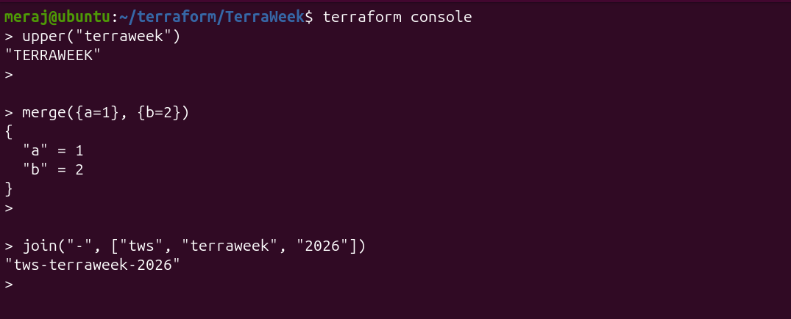

> 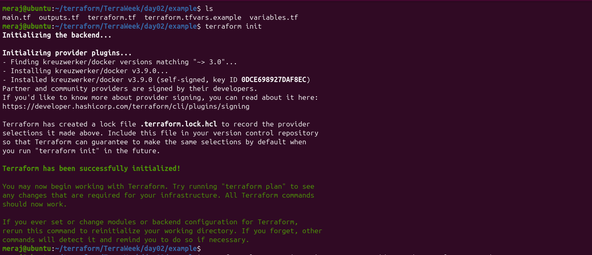

---

## Task 4: Docker-Backed Example (variable-driven)

Config lives in [`example/`](./example) — `kreuzwerker/docker` pulls
`nginx:latest` and runs a container, with the image, name, and ports all
controlled by variables.

**Prereq:** Docker installed and running (`docker ps` should work
without errors).

### Run 1 — using `-var` flags

```bash
cd example
terraform init
terraform plan  -var 'container_name=tws-web' -var 'external_port=8080'
terraform apply -var 'container_name=tws-web' -var 'external_port=8080'
# visit http://localhost:8080 — you should see the Nginx welcome page
terraform output
terraform destroy -var 'container_name=tws-web' -var 'external_port=8080'
```
> 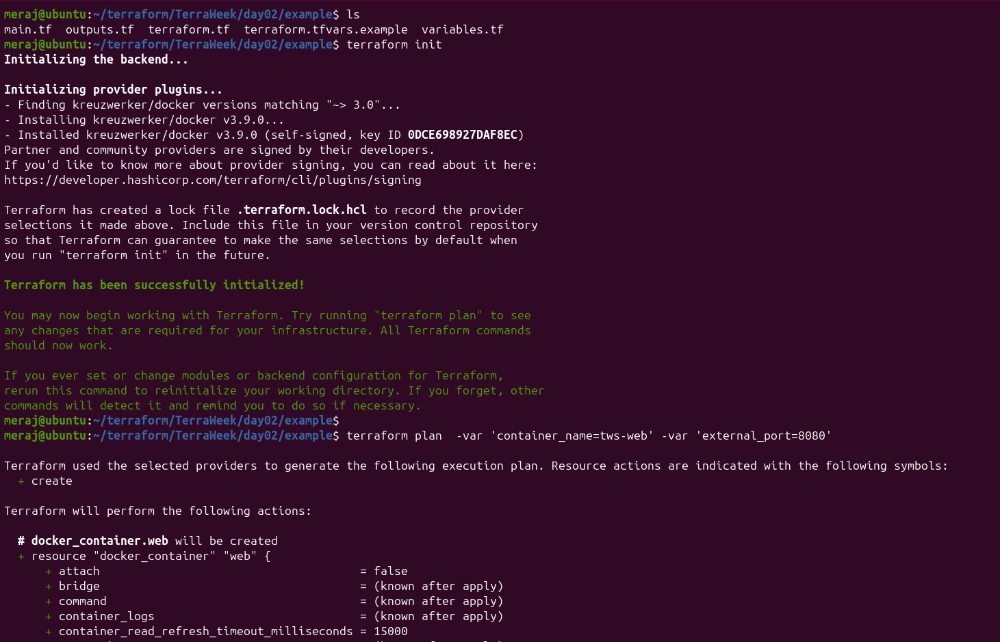
> 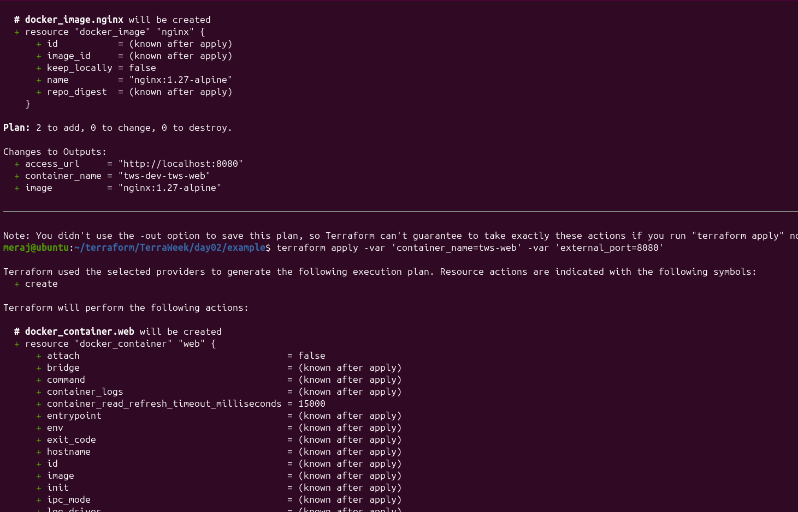
> 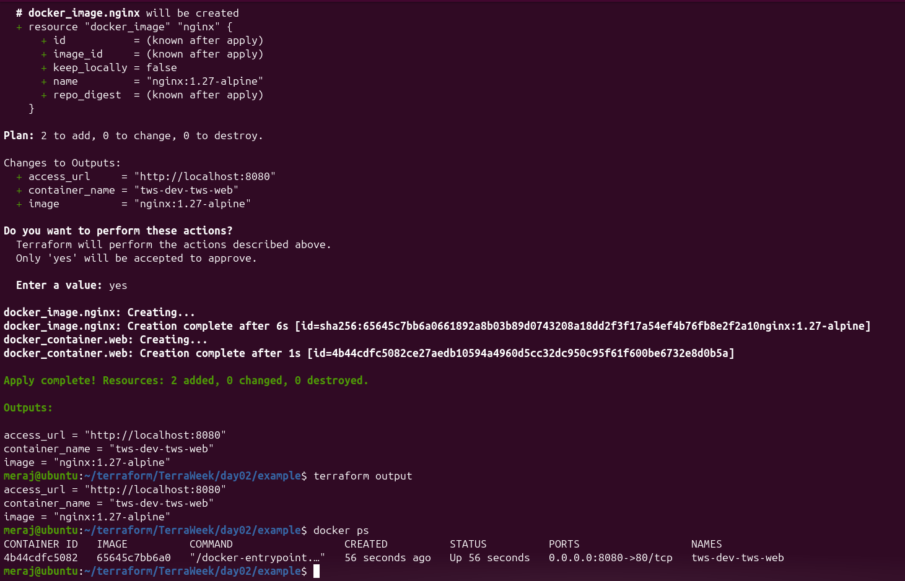
> 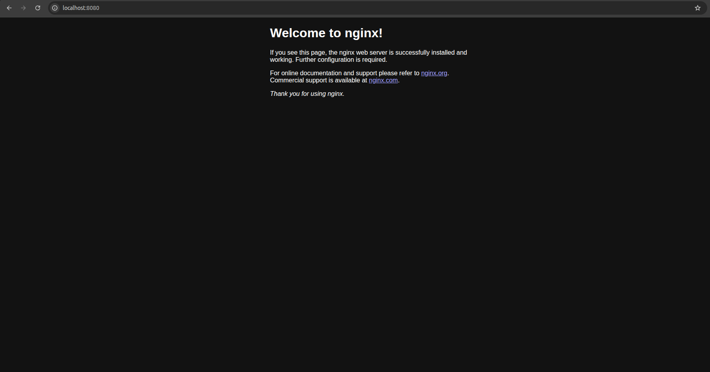
> 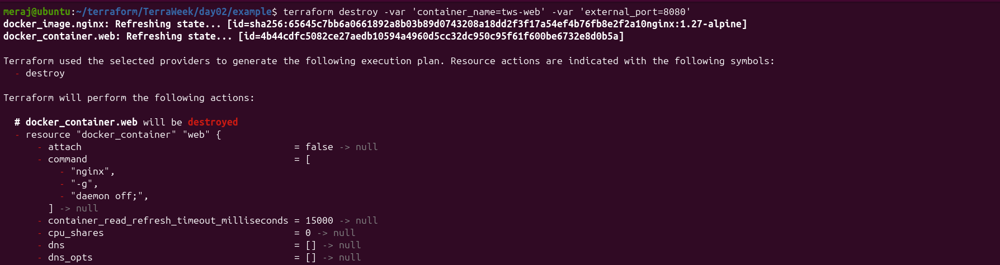
> 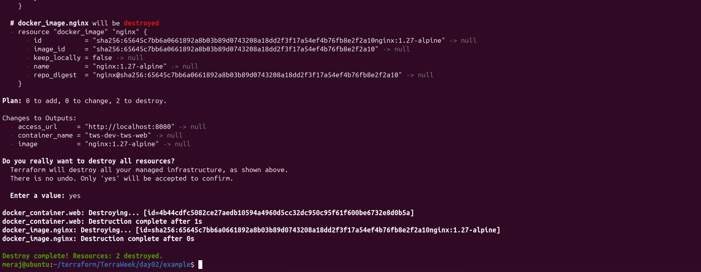

### Run 2 — using `terraform.tfvars` instead

I dropped the same two values into
[`example/terraform.tfvars`](./example/terraform.tfvars):

```hcl
container_name = "tws-web"
external_port  = 8080
```

Then just:

```bash
terraform plan
terraform apply
terraform output
terraform destroy
```
> 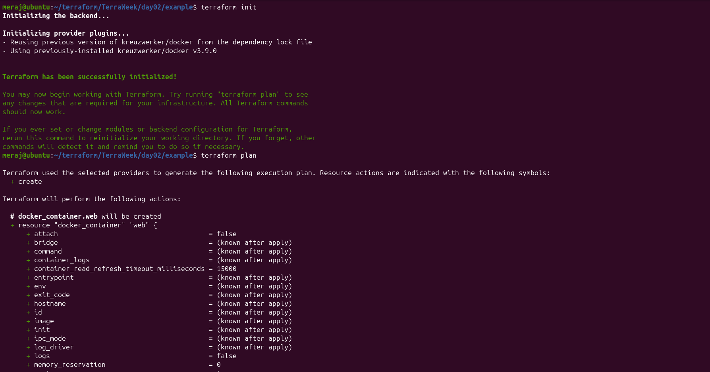
> 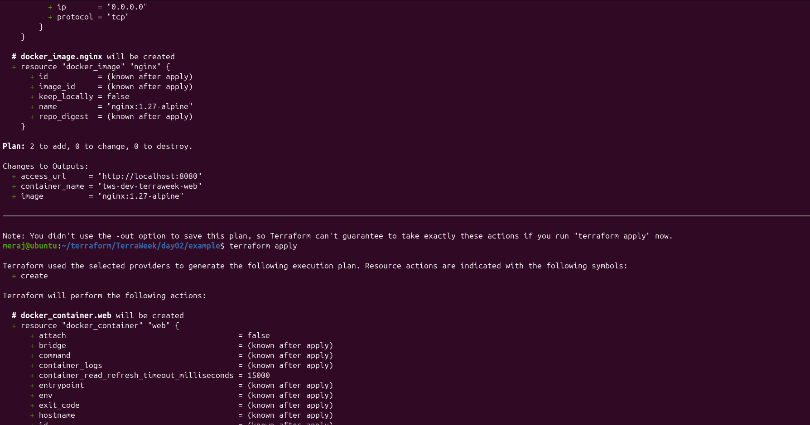
> 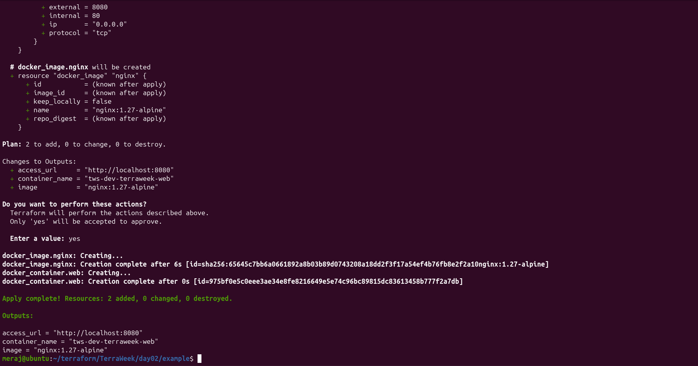
> 

**Difference observed:** identical plan/apply behavior and identical
result — but the command line is far shorter, and the values are no
longer something I have to retype (or risk forgetting) on every run.
`terraform.tfvars` is auto-loaded by Terraform with **no flag needed**,
whereas `-var` values only apply to that single invocation and must be
repeated for `plan`, `apply`, and `destroy` alike. `.tfvars` files are
also easy to keep out of Git (see `.gitignore`) or swap per-environment
(`dev.tfvars`, `prod.tfvars`) with `-var-file=dev.tfvars`.

Swap the two `docker_*` resources for a
`local_file` resource whose `content` is built from the same
variables — the variables/locals/outputs concepts don't change at all,
only the provider does.

---

## 📊 Variable Precedence (highest wins)

```
-var / -var-file  ▶  *.auto.tfvars  ▶  terraform.tfvars  ▶  TF_VAR_ env vars  ▶  default
```

In words:

1. `-var` and `-var-file` on the command line win over everything.
2. Any `*.auto.tfvars` (or `*.auto.tfvars.json`) file, auto-loaded, wins next.
3. `terraform.tfvars` (or `.json`), also auto-loaded, wins next.
4. `TF_VAR_<name>` environment variables (e.g. `export TF_VAR_environment=prod`) come after that.
5. The variable's `default` in `variables.tf` is the fallback if nothing else sets it.

I confirmed this by setting `TF_VAR_external_port=9090`, keeping
`external_port = 8080` in `terraform.tfvars`, and running
`terraform plan -var 'external_port=7070'` — the container ended up on
port **7070**, proving the command-line flag wins over both the env var
and the tfvars file.

---
