# TerraWeek Day 3 — Notes

---

## AWS_CLI_Setup

> 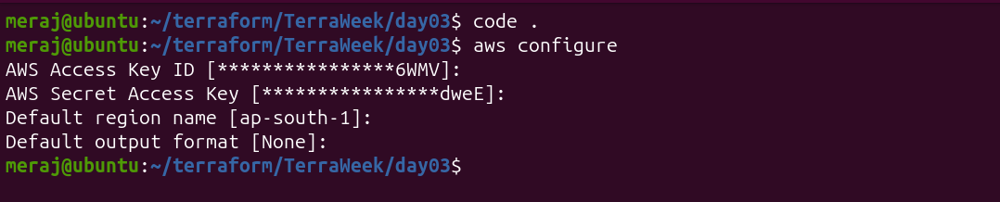

---

## Task 1: Providers & Version Pinning

**What I did**
- Added a `terraform` block with `required_version = ">= 1.7.0"`.
- Pinned the AWS provider with `required_providers { aws = { source = "hashicorp/aws", version = "~> 6.0" } }`.
- Configured the `provider "aws"` block with `region = var.aws_region` and `default_tags` (Project/ManagedBy) so every resource is tagged consistently.
- **Bonus:** added a second provider block with `alias = "dr"` pointing at a different region (`us-east-1`), to show how a resource can opt into it via `provider = aws.dr`.

**Why version pinning matters**
Without pinning, `terraform init` can silently pull a newer provider version
on a different machine or in CI, which may introduce breaking changes
(renamed/removed arguments) and produce a plan different from what was
tested locally. Pinning + the committed `.terraform.lock.hcl` file makes
builds reproducible across machines and time.

**What `~>` (pessimistic constraint) does**
- `~> 6.0` → allow `>= 6.0.0` and `< 7.0.0` (any 6.x patch/minor, never 7.0)
- `~> 6.1` → allow `>= 6.1.0` and `< 6.2.0` (locks the minor version too)

It lets `terraform init -upgrade` pick up non-breaking fixes automatically
while blocking major-version breaking changes.

**When to use a second provider alias**
When one config needs to talk to more than one region/account at once —
e.g. replicating an S3 bucket to a DR region, provisioning an ACM cert for
CloudFront (must live in `us-east-1`) while the rest of the stack lives
elsewhere, or cross-region VPC peering.

> 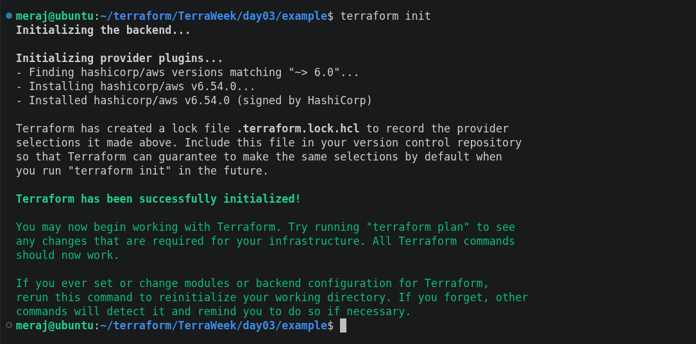

---

## Task 2: Resources vs Data Sources

**What I did**
- Resource created: the whole stack (VPC, subnet, IGW, route table, SG, EC2 instances) — these are things Terraform now owns and manages.
- Data sources used:
  - `data.aws_ami.al2023` — looks up the latest Amazon Linux 2023 AMI (owner `amazon`, filtered by name pattern and `hvm` virtualization).
  - `data.aws_availability_zones.available` — reads the list of AZs available in the account/region, used to place the public subnet.

**The difference**
| | `resource` | `data` |
|---|---|---|
| Lifecycle | Terraform creates, updates, and destroys it | Terraform only reads it |
| Ownership | Terraform "owns" the object | Object exists independently (AWS-managed, or created elsewhere) |
| Effect of deleting the block | Real object gets destroyed on apply | Nothing happens to the real object — Terraform just stops reading it |

---

## Task 3: Provision a Cloud Stack

Built exactly the stack from the networking primer:

```
Internet ──▶ [IGW] ──▶ [Route Table] ──▶ [ Public Subnet ] ──▶ [SG] ──▶ [EC2]
                                          (inside the VPC)
```

- `aws_vpc.main` — `10.0.0.0/16`, DNS support + hostnames enabled.
- `aws_subnet.public` — `10.0.1.0/24`, placed in `data.aws_availability_zones.available.names[0]`, `map_public_ip_on_launch = true`.
- `aws_internet_gateway.igw` — attached to the VPC.
- `aws_route_table.public` — default route `0.0.0.0/0` → the IGW.
- `aws_route_table_association.public` — links the subnet to that route table.
- `aws_security_group.web` — inbound 22 (SSH) and 80 (HTTP), all outbound.
- `aws_instance.web` — uses `data.aws_ami.al2023.id`, placed in the public subnet, SG attached, `t3.micro` (free-tier friendly).

Commands run locally:
```bash
terraform init
terraform validate
terraform plan
terraform apply      # yes
terraform state list
```
> 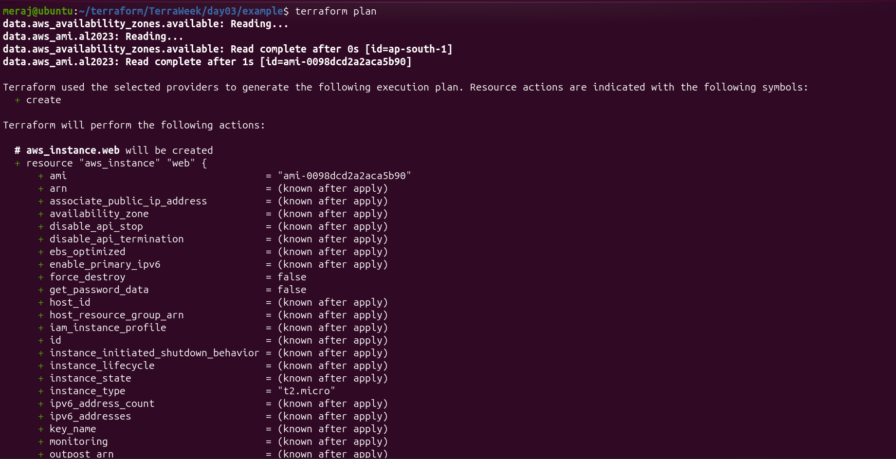
> 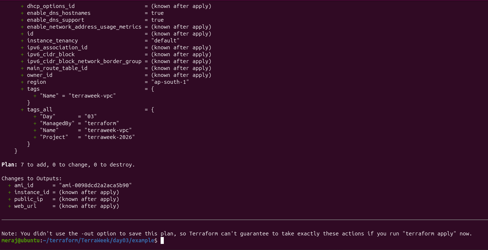
> 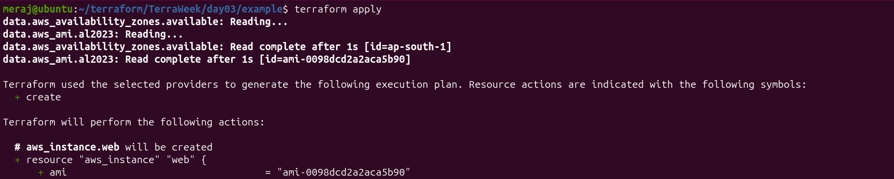
> 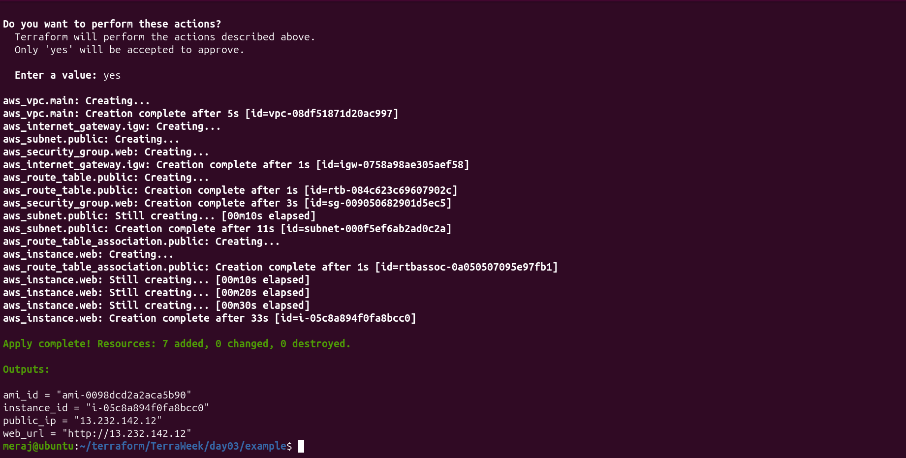

`terraform state list` afterward shows every resource Terraform now
manages: the VPC, subnet, IGW, route table + association, SG, and instance.

> 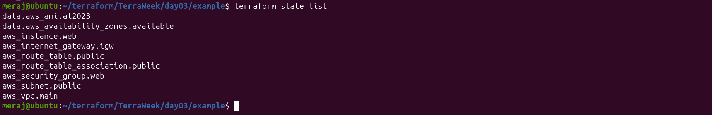
> 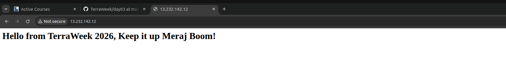
---

## Task 4: Meta-Arguments in Action

- **`count`** — `aws_instance.worker`, count = `var.worker_count` (2), creates identical interchangeable instances named `terraweek-worker-0`, `terraweek-worker-1`.
- **`for_each`** — `aws_instance.app`, iterates over `var.extra_instances` (a map with keys `web`, `api`), creating named instances `terraweek-web`, `terraweek-api`. Removing one key from the map only destroys that instance — the others keep their identity/state (no reindexing), unlike `count`.
- **`depends_on`** — `aws_instance.web` explicitly depends on `aws_route_table_association.public`, so the instance never boots before the subnet actually has a route to the internet (needed for the `user_data` script to reach package repos).
- **`lifecycle`** — on `aws_instance.web` and `aws_security_group.web`:
  ```hcl
  lifecycle {
    create_before_destroy = true
    ignore_changes        = [tags["LastModified"]]
  }
  ```
  - `create_before_destroy` — on a forced replacement, build the new resource first, then delete the old one (avoids downtime).
  - `ignore_changes = [tags["LastModified"]]` — a tag I update outside Terraform (e.g. via automation) shouldn't show up as configuration drift on every plan.
  - `prevent_destroy` — noted but not enabled by default (would block `terraform destroy` on that resource); worth turning on for genuinely critical prod resources.

**`count` vs `for_each` — my takeaway:** use `count` for N truly
interchangeable copies; use `for_each` the moment each instance has a name
or role that matters, so deleting one doesn't reshuffle the rest.

> 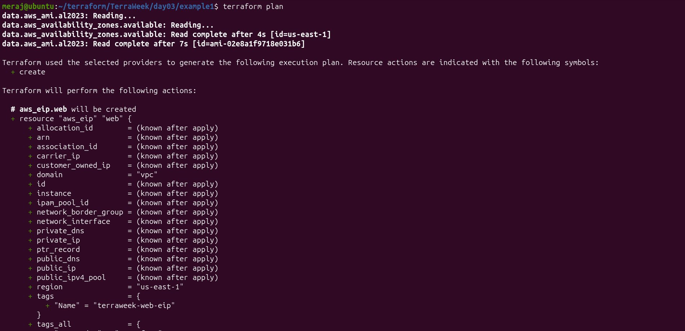
> 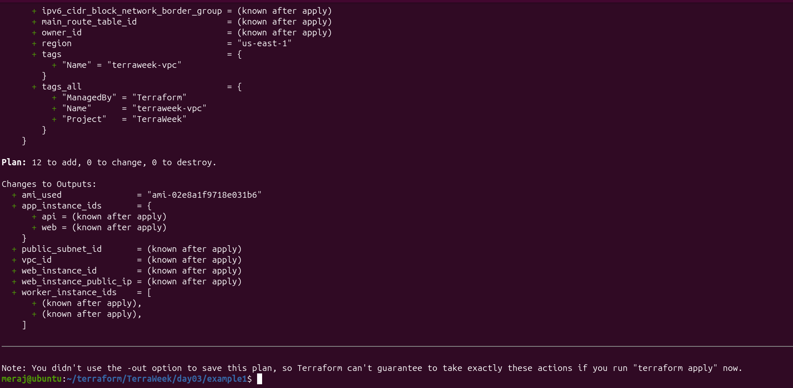
> 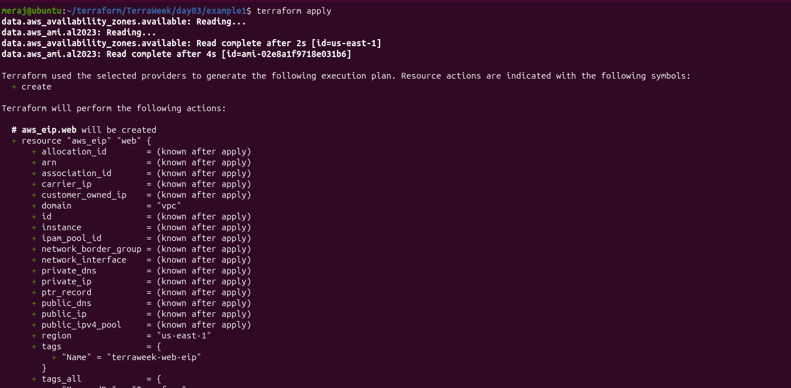
> 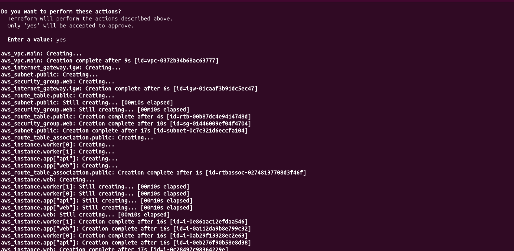
> 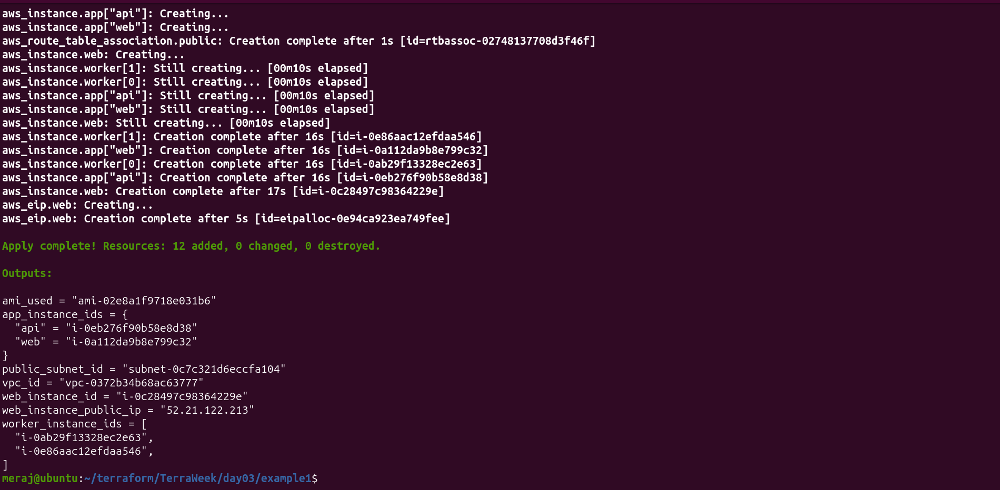
---

## Task 5: Update & Destroy

**In-place update test:** changed a regular tag value → `terraform plan`
showed `~ update in-place`.

**Forces-replacement test:** changed `instance_type` on `aws_instance.web`
(`t3.micro` → `t3.small`) → `terraform plan` showed
`-/+ destroy and then create replacement`. Because `create_before_destroy`
is set, the new instance is actually created *before* the old one is torn
down, so there's no gap in availability.

**Cleanup:**
```bash
terraform destroy   # yes
```
> 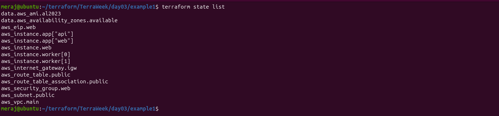
> 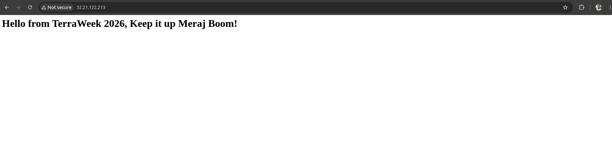
> 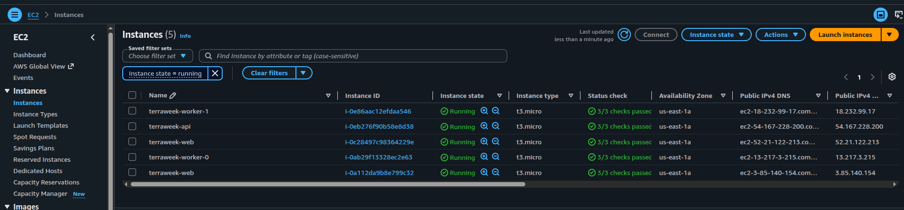
> 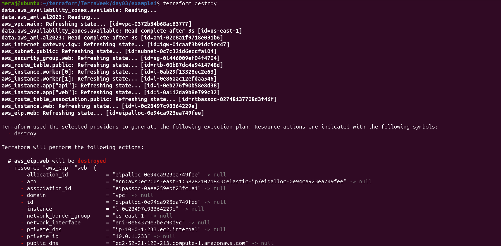
> 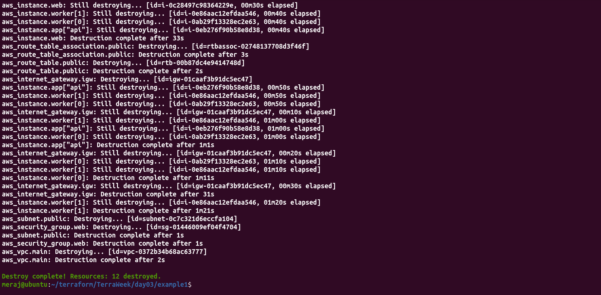

Always run this last to avoid leaving billable resources (EIP, EC2, etc.)
running.

---
